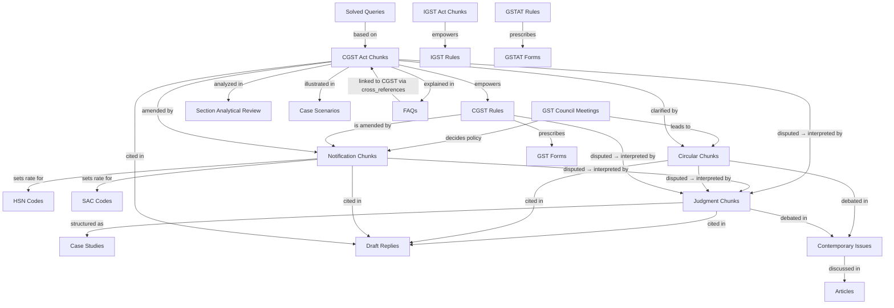

# GST Legal Chatbot — Data Types: Plain English Guide

> **Purpose:** To clearly explain what each data type *actually contains*, how each one connects to the others, and how the chatbot should use them together to answer legal GST questions.

---

## The Big Picture

Think of the chatbot as a **very smart GST lawyer's assistant**. When someone asks a question, the assistant doesn't know the answer from memory — it looks up the right combination of documents from 21 different "bookshelves." Each bookshelf holds a different kind of document.

The golden rule:

> **Acts are the law. Rules explain how to follow it. Notifications change it. Circulars clarify it. Judgments interpret it. Everything else helps the chatbot explain it.**

---

## How the Data Types Flow Into Each Other

```
┌─────────────────────────────────────────────────────────────────┐
│                  THE FOUNDATION (THE LAW)                       │
│           CGST Act  +  IGST Act  +  GSTAT Rules                 │
└───────────────────────────┬─────────────────────────────────────┘
                            │ empowers (says "as may be prescribed")
                            ▼
┌─────────────────────────────────────────────────────────────────┐
│                   THE PROCEDURES (THE RULES)                    │
│            CGST Rules  +  IGST Rules  +  GST Forms              │
└───────────────────────────┬─────────────────────────────────────┘
                            │ are amended/updated by
                            ▼
┌─────────────────────────────────────────────────────────────────┐
│                THE LIVE UPDATES (NOTIFICATIONS)                 │
│       Notification Chunks  ←  GST Council Meetings decide       │
└───────────────────────────┬─────────────────────────────────────┘
                            │ explained/clarified by
                            ▼
┌─────────────────────────────────────────────────────────────────┐
│                  THE CLARIFICATIONS (CIRCULARS)                 │
└───────────────────────────┬─────────────────────────────────────┘
                            │ challenged in courts → interpreted by
                            ▼
┌─────────────────────────────────────────────────────────────────┐
│                   THE VERDICTS (JUDGMENTS)                      │
│             Judgment Chunks  +  Case Studies                    │
└───────────────────────────┬─────────────────────────────────────┘
                            │ simplified into
                            ▼
┌─────────────────────────────────────────────────────────────────┐
│               THE KNOWLEDGE LAYER (CHATBOT-FRIENDLY)            │
│  FAQs · Solved Queries · Scenarios · Analytical Review          │
│  Articles · Contemporary Issues · Draft Replies                 │
└─────────────────────────────────────────────────────────────────┘
                            │
           HSN & SAC codes act as the classification bridge
           connecting a product/service to its tax rate
           across Acts, Notifications & Circulars
```

---

## Data Type 1: CGST Act Chunks ([cgst_chunks.json](file:///c:/Users/SaifMalik/Desktop/Aaizel%20Tech/wddmas-commercial-server/data/processed/cgst_chunks.json))

### What it actually contains
Sections of the **Central Goods and Services Tax Act, 2017** — the law passed by Parliament for intra-state transactions (within one state). Each chunk is one section or sub-section of the Act.

**Actual content examples:**
- Section 2 — All definitions (e.g., "what is a 'supply'?", "what is 'aggregate turnover'?")
- Section 9 — The main levy of GST
- Section 16 — Who can claim Input Tax Credit (ITC) and under what conditions
- Section 73/74 — Demand and recovery of taxes
- Section 122/130 — Offences and penalties

### Simple Explanation
This is like the **Constitution of GST**. It is written by Parliament and has the highest authority. Everything else in the system either follows from it or refers back to it.

### How the Chatbot Uses It
Any question about *whether* something is taxable, *who* must register, *when* ITC can be claimed — the answer starts here. The chatbot must **always** cite the Act section when giving a legal answer.

**Example:**
> User: "Can my company claim ITC on a car purchased for sales staff?"
> Chatbot retrieves: **Section 17(5)(a) of CGST Act** — which lists blocked credits including motor vehicles.

### Connections to Other Data Types
| Connects to | How |
|------------|-----|
| `cgst_rules_chunks` | The Act says "as may be prescribed" — the Rules prescribe the HOW |
| `notification_chunks` | Notifications can amend or override Act provisions |
| `circular_chunks` | Circulars clarify ambiguous sections of the Act |
| `judgment_chunks` | Courts interpret disputed sections of the Act |
| `section_analytical_review` | Experts analyze each section in plain language |
| `case_scenarios` | Scenarios apply Act sections to real-life problems |
| `faqs` | FAQs link back to specific Act sections via `cross_references.sections` |

---

## Data Type 2: IGST Act Chunks ([igst_chunks.json](file:///c:/Users/SaifMalik/Desktop/Aaizel%20Tech/wddmas-commercial-server/data/processed/igst_chunks.json))

### What it actually contains
Sections of the **Integrated Goods and Services Tax Act, 2017** — the law for inter-state transactions (between two different states) and imports.

**Key sections:**
- Section 5 — Levy of IGST
- Section 7–13 — Place of supply rules (determines *which state* gets the tax)
- Section 16 — Zero-rating of exports

### Simple Explanation
When a seller in Delhi ships goods to a buyer in Mumbai, IGST applies — not CGST+SGST. When goods are imported, IGST applies at the border. This Act handles all cross-border GST.

### How the Chatbot Uses It
Any question about **imports, exports, or transactions between two states** requires this data. The chatbot must check the IGST Act to determine which tax applies and which state collects it.

**Example:**
> User: "I export software services to the US. Do I pay GST?"
> Chatbot retrieves: **Section 16 of IGST Act** — exports are zero-rated, meaning 0% GST.

### Connections to Other Data Types
Same as CGST Act, but specifically for inter-state and cross-border scenarios. Always pair with `igst_rules_chunks` for procedural details.

---

## Data Type 3: CGST Rules Chunks ([cgst_rules_chunks.json](file:///c:/Users/SaifMalik/Desktop/Aaizel%20Tech/wddmas-commercial-server/data/processed/cgst_rules_chunks.json))

### What it actually contains
The **CGST Rules, 2017** — the government's detailed instructions on *how* to comply with the CGST Act. Each Rule corresponds to one or more sections of the Act.

**Actual content examples:**
- Rule 36 — What documents you need to claim ITC (invoices, debit notes, etc.)
- Rule 46 — How a tax invoice must look (what fields it must contain)
- Rule 61 — How to fill in and file GSTR-3B
- Rule 86B — Restrictions on using ITC for payment (introduced in 2021)
- Rule 138 — E-way bill: when to generate it, how, what details to include

### Simple Explanation
If the Act is the **law**, the Rules are the **instruction manual**. The Act says "ITC can be claimed if proper documents exist." The Rules say "those documents must be a tax invoice showing the supplier's GSTIN, HSN code, tax amount..."

### How the Chatbot Uses It
For any **procedural** question — how to file a return, what format an invoice must be in, when an E-way bill is needed — the answer is in the Rules.

**Example:**
> User: "What details must a GST invoice contain?"
> Chatbot retrieves: **Rule 46 of CGST Rules** — lists all 16 mandatory fields on a tax invoice.

### Connections to Other Data Types
| Connects to | How |
|------------|-----|
| `cgst_chunks` | Each Rule is made under a specific Act section (parent-child) |
| `notification_chunks` | Notifications regularly amend Rules (add/remove sub-rules) |
| `forms` | Rules prescribe which forms to use (Rule 61 → GSTR-3B) |
| `judgment_chunks` | Courts interpret disputed Rules (e.g., Rule 86A misuse cases) |
| `draft_replies` | Draft replies cite Rules when responding to notices |

---

## Data Type 4: IGST Rules Chunks ([igst_rules_chunks.json](file:///c:/Users/SaifMalik/Desktop/Aaizel%20Tech/wddmas-commercial-server/data/processed/igst_rules_chunks.json))

### What it actually contains
Rules under the IGST Act — primarily covering **place of supply** determination, LUT/Bond for exports, and refund procedures for exporters.

### Simple Explanation
How do you prove your service was delivered *outside India* to claim export exemption? How do you determine which state's SGST applies? The IGST Rules answer these procedural questions.

### How the Chatbot Uses It
Pair always with `igst_chunks`. Used for questions about export procedures, determining place of supply, and cross-border transaction compliance.

---

## Data Type 5: Notification Chunks ([notification_chunks.json](file:///c:/Users/SaifMalik/Desktop/Aaizel%20Tech/wddmas-commercial-server/data/processed/notification_chunks.json))

### What it actually contains
Official **government notifications** issued by the Ministry of Finance under the authority of the CGST/IGST Acts. These are the most frequently changing documents in the system.

**Actual content examples:**
- Rate notifications: "Notification 1/2017-CT(Rate) — GST rate schedule for goods"
- Exemption notifications: "Notification 12/2017-CT(Rate) — list of exempt services"
- Extension notifications: "GSTR-3B due date for March extended to 20th May"
- Amendment notifications: "Rule 138 amended to require E-way bills for goods above ₹50,000"

The data contains: notification number, date, subject, and the full text of what's changed.

### Simple Explanation
Notifications are the government's way of **changing the rules without going back to Parliament**. The Act gives the government power to notify rates, exemptions, and deadlines. So whenever tax rates change, a notification is issued.

> Think of it like app updates — the Act is the app, notifications are the version updates.

### ⚠️ Critical RAG Rule
**Always check notifications for the current rate or deadline.** The Act might say "GST is levied at such rate as notified." The actual rate lives in notifications, not in the Act text itself. A notification can override an Act provision.

**Example:**
> User: "What is GST on construction services for affordable housing?"
> Chatbot retrieves: **Notification 11/2017-CT(Rate) as amended by Notification 03/2019-CT(Rate)** — rate reduced to 1% for affordable housing. The Act alone won't give you this answer.

### Connections to Other Data Types
| Connects to | How |
|------------|-----|
| `cgst_chunks` / `igst_chunks` | Notifications are issued under Act sections |
| `cgst_rules_chunks` | Notifications amend specific Rules |
| `hsn_chunks` / `sac_chunks` | Rate notifications reference HSN/SAC codes directly |
| `gst_council_meetings` | Council meetings decide notification content |
| `circular_chunks` | Circulars often explain how a new notification should be applied |

---

## Data Type 6: Circular Chunks ([circular_chunks.json](file:///c:/Users/SaifMalik/Desktop/Aaizel%20Tech/wddmas-commercial-server/data/processed/circular_chunks.json))

### What it actually contains
Circulars issued by **CBIC (Central Board of Indirect Taxes & Customs)** under Section 168(1) of the CGST Act. They are administrative instructions to tax officers for uniform implementation.

**Actual content examples:**
- Circular 16/2017-GST: "Clarification on applicability of GST and availability of ITC in certain cases"
- Circular 199/11/2023-GST: "Taxability of services provided by an office of an organisation in one state to office in another state (cross-charge)"
- Circular on E-way bills: How officers should handle cancelled E-way bills during interception

The data contains: circular number, date, subject, and the full text of the clarification.

### Simple Explanation
When a new notification is issued or a section of the law is confusing, tax officers across India might apply it differently. CBIC issues circulars to say: **"Here is exactly how this should be interpreted. Everyone apply it the same way."**

Imagine 100 tax officers each reading the same law differently — circulars fix that inconsistency.

### ⚠️ Key Distinction
- **Binding on tax officers** — they must follow it
- **NOT binding on courts or taxpayers** — a court can overrule a circular
- If a circular contradicts a judgment, **the judgment wins**

**Example:**
> User: "Does our head office need to charge GST when allocating HR costs to a branch office in another state?"
> Chatbot retrieves: **Circular 199/11/2023-GST** — clarifies that if the branch is eligible for full ITC, the cross-charge value can be deemed Nil.

### Connections to Other Data Types
| Connects to | How |
|------------|-----|
| `cgst_chunks` | Circulars always refer to the section they are clarifying |
| `notification_chunks` | Many circulars explain how to implement a new notification |
| `judgment_chunks` | Always check if a circular has been challenged/upheld in court |
| `draft_replies` | Draft replies heavily cite circulars as supporting authority |

---

## Data Type 7: GST Council Meetings ([gst_council_meetings.json](file:///c:/Users/SaifMalik/Desktop/Aaizel%20Tech/wddmas-commercial-server/data/processed/gst_council_meetings.json))

### What it actually contains
Meeting minutes, agendas, and decisions of the **GST Council** — the constitutional body (Article 279A) chaired by the Union Finance Minister with state Finance Ministers as members. This body makes all major GST policy decisions.

**Actual content examples:**
- Meeting 47 (June 2022): "Withdrew GST exemption on pre-packaged and labelled food items"
- Meeting 43 (May 2021): "On COVID-related temporary exemptions for medicines"
- Meeting discussions on rate rationalization proposals

### Simple Explanation
The GST Council is like the **board of directors** for GST policy. Its decisions are not law by themselves — they must be implemented via notifications. But they explain **why** a change was made.

Think of it as the **backstory** behind every notification.

**Example:**
> User: "Why was GST on online gaming increased to 28%?"
> Chatbot retrieves: **GST Council 50th & 51st meeting discussions** — explains the policy reasoning.

### Connections to Other Data Types
| Connects to | How |
|------------|-----|
| `notification_chunks` | Every rate/exemption change originates from a Council decision |
| `circular_chunks` | Council decisions often lead to clarificatory circulars |
| `contemporary_issues` | Unresolved Council debates feed into contemporary issues |

---

## Data Type 8: HSN Chunks ([hsn_chunks.json](file:///c:/Users/SaifMalik/Desktop/Aaizel%20Tech/wddmas-commercial-server/data/processed/hsn_chunks.json))

### What it actually contains
The complete **Harmonized System of Nomenclature (HSN)** code master — a global classification system for every physical good. The data contains 262,000+ entries.

**Actual content example:**
```
HSN Code 1012100: Horses: Pure-bred breeding animals
CGST: 2.5% | SGST: 2.5% | IGST: 5% | CESS: 0

HSN Code 3808 (Disinfectants/Hand sanitizers)
CGST: 6% | SGST: 6% | IGST: 12% | CESS: 0
```

Each entry has: HSN code, description, chapter name, and **actual CGST/SGST/IGST/cess rates**.

### Simple Explanation
Every physical product in the world has an HSN code — a number that identifies it. The HSN master is essentially the **"price list" of GST rates for goods**. You look up the product, find its HSN code, and you immediately know the GST rate.

A 4-digit HSN code is general (e.g., 0101 = Live horses), an 8-digit code is very specific (0101-21-00 = Pure-bred breeding horses).

### How the Chatbot Uses It
When a user asks **"What is GST on [product]?"**, this is the first data type to retrieve. Match the product description to an HSN code, then read off the rate.

**Example:**
> User: "What is GST on hand sanitizers?"
> Chatbot retrieves: **HSN 3808** → IGST: 12%
> Then optionally retrieves relevant notification to confirm this rate is still current.

### Connections to Other Data Types
| Connects to | How |
|------------|-----|
| `notification_chunks` | Rate notifications override HSN master rates (latest notification wins) |
| `circular_chunks` | Classification disputes are clarified by circulars |
| `judgment_chunks` | HSN classification is frequently disputed in courts |
| `cgst_chunks` | Section 9 read with First Schedule to Customs Tariff Act references HSN |

---

## Data Type 9: SAC Chunks ([sac_chunks.json](file:///c:/Users/SaifMalik/Desktop/Aaizel%20Tech/wddmas-commercial-server/data/processed/sac_chunks.json))

### What it actually contains
The **Services Accounting Code (SAC)** master — India's classification system for services under GST, similar to HSN codes for goods. Every type of service has a SAC code.

**Actual content examples:**
- SAC 998213 — Legal advisory and representation services → 18% GST
- SAC 996311 — Hotel accommodation → 12% or 18% depending on tariff
- SAC 998399 — Software development services → 18% GST

### Simple Explanation
Just as goods have HSN codes, services have SAC codes. If someone provides a service, you find its SAC code, and that tells you the GST rate.

**Example:**
> User: "What GST applies to a CA firm for audit services?"
> Chatbot retrieves: **SAC 998221** (Accounting, auditing and bookkeeping services) → 18% GST

### Connections to Other Data Types
Same as HSN but for services. Always cross-check with latest rate notifications.

---

## Data Type 10: Forms ([forms.json](file:///c:/Users/SaifMalik/Desktop/Aaizel%20Tech/wddmas-commercial-server/data/processed/forms.json))

### What it actually contains
Information about all the official **GST return forms** that businesses file with the government — their purpose, frequency, and what they contain.

**Actual content examples:**
- **GSTR-1**: Monthly/quarterly statement of all outward supplies made by business
- **GSTR-3B**: Monthly self-assessed summary return (output tax + input tax credit)
- **GSTR-9**: Annual return — full year summary of all transactions
- **GSTR-9C**: Annual reconciliation statement (for businesses above ₹5 crore — needs CA certification)
- **RFD-01**: Application for GST refund
- **REG-01**: Application for GST registration

### Simple Explanation
Every GST-registered business must file regular forms/returns to the government — similar to how an employee files an income tax return. Each form serves a specific compliance purpose.

GSTR-1 tells the government what you sold. GSTR-3B tells it how much tax you owe. GSTR-9 is the annual summary.

**Example:**
> User: "When and how do I file my annual return?"
> Chatbot retrieves: **GSTR-9 from forms data** → filed by 31st December of following financial year, requires reconciliation of all 12 monthly GSTR-3Bs.

### Connections to Other Data Types
| Connects to | How |
|------------|-----|
| `cgst_rules_chunks` | Each form is prescribed by a specific Rule (Rule 61 → GSTR-3B) |
| `notification_chunks` | Due dates for forms are set/extended by notifications |
| `circular_chunks` | Circulars clarify how to fill in specific fields |
| `judgment_chunks` | Disputes about late fees, form errors, etc. |

---

## Data Type 11: GSTAT Rules ([gstat_rules.json](file:///c:/Users/SaifMalik/Desktop/Aaizel%20Tech/wddmas-commercial-server/data/processed/gstat_rules.json))

### What it actually contains
Rules governing the **Goods and Services Tax Appellate Tribunal (GSTAT)** — the specialized court established to hear GST disputes after the first two levels of appeal (adjudicating authority and Commissioner Appeals).

**Content includes:** Procedures for filing appeals, composition of tribunal benches, timelines, qualifications of members, hearing procedures.

### Simple Explanation
If a taxpayer fights with the tax department and loses at the first two levels of appeal, they can go to the GSTAT. These rules tell you **how to fight that battle** — what forms to file, how many days you have, what fees to pay.

### Connections to Other Data Types
| Connects to | How |
|------------|-----|
| `gstat_forms` | The forms used to file appeals before GSTAT |
| `judgment_chunks` | GSTAT decisions appear as judgments |
| `cgst_chunks` | Sections 109-112 of CGST Act establish GSTAT |

---

## Data Type 12: GSTAT Forms ([gstat_forms.json](file:///c:/Users/SaifMalik/Desktop/Aaizel%20Tech/wddmas-commercial-server/data/processed/gstat_forms.json))

### What it actually contains
The specific **forms used in GSTAT proceedings** — appeal memos, applications, format of written submissions.

### Simple Explanation
The paperwork you fill in to appeal to the tribunal. Similar to how you fill GSTR-1 for compliance, you fill GSTAT forms for appealing to the tribunal.

---

## Data Type 13: Judgment Chunks ([judgment_chunks.json](file:///c:/Users/SaifMalik/Desktop/Aaizel%20Tech/wddmas-commercial-server/data/processed/judgment_chunks.json))

### What it actually contains
This is the **largest dataset** (~450MB). It contains court orders and judgments from High Courts, the Supreme Court, and the GSTAT — all related to GST disputes.

**Actual content example (from Kerala High Court, 2017):**
```
Case: Ashok Leyland Ltd. vs. Assistant State Tax Officer
Section: Section 129, Rule 138 (E-way bill)
Court: Kerala High Court
Decision: In favour of assessee
Case Note: Department cannot detain goods that are accompanied 
by valid invoices and E-way bills merely on suspicion. Detention 
must be based on specific evidence of tax evasion.
Current Status: Referred in [later case]
```

**Each judgment tells you:**
- Who fought (petitioner vs. respondent)
- What law was disputed (section/rule number)
- What the court decided ("in favour of assessee" or "in favour of department")
- Whether the judgment is still good law (`current_status` field)
- A summary of the legal ruling (`case_note` field)

### Simple Explanation
When taxpayers and the tax department disagree about how a law applies, they go to court. Judges read the law and decide who is right. That decision becomes a **precedent** — future cases with similar facts follow the same ruling.

This dataset is your collection of all those precedents.

### ⚠️ Critical Field — `current_status`
Always check this before citing a judgment. If it says **"Overruled by Supreme Court in..."** — you CANNOT use that judgment as authority. It has been legally invalidated.

**Example:**
> User: "The GST officer detained my truck even though all documents were in order. What can I do?"
> Chatbot retrieves: **Ashok Leyland Kerala HC judgment** → courts have ruled that arbitrary detention without evidence of evasion is illegal. Use this as defense.
> Then retrieves: **Section 129 of CGST Act** (the statutory detention provision) for legal grounding.

### Connections to Other Data Types
| Connects to | How |
|------------|-----|
| `cgst_chunks` | Every judgment references sections it interprets |
| `cgst_rules_chunks` | Judgments reference the rules in dispute |
| `circular_chunks` | Circulars are often challenged in court — judgment overrules circular |
| `draft_replies` | Best judgments are included in draft replies to notices |
| `case_studies` | Case studies are structured analyses of key judgments |

---

## Data Type 14: Case Studies ([case_studies.json](file:///c:/Users/SaifMalik/Desktop/Aaizel%20Tech/wddmas-commercial-server/data/processed/case_studies.json))

### What it actually contains
Detailed, structured analyses of actual GST cases — with clear explanation of the facts, the legal issue, the arguments, and the outcome. More readable than raw judgment text.

### Simple Explanation
A judgment chunk is the actual court order — dense legal language. A case study is the same case explained like a **law school textbook** — organized into "Facts → Issue → Arguments → Decision → Takeaway."

**Example:**
> Judgment chunk: 15 pages of court order text
> Case study: "The taxpayer sold goods via an agent. Issue: Was this principal-to-agent transfer a taxable supply? Decision: Yes, per Schedule I of CGST Act, supplies to agents on whose behalf you sell are taxable even without consideration."

### Connections to Other Data Types
Directly derived from `judgment_chunks`. Use case studies when the chatbot needs to explain a complex decision to a non-lawyer user.

---

## Data Type 15: FAQs ([faqs.json](file:///c:/Users/SaifMalik/Desktop/Aaizel%20Tech/wddmas-commercial-server/data/processed/faqs.json))

### What it actually contains
Officially published **Frequently Asked Questions** by CBIC, organized by topic. Topics include Anti-Profiteering, ITC, Registration, Returns, E-way bills, and more.

**Actual content example:**
```
Parent Doc: Anti-Profiteering
Q1: What is profiteering under GST?
A: Profiteering means not passing on the benefit of GST rate 
   reductions or ITC benefits to consumers through price reductions.
Cross References: Sections [171], Rules []
Keywords: [profiteering, benefit, tax, 171]
```

### Simple Explanation
The chatbot's **"quick answer"** layer. When a user asks a common, simple question — the FAQ gives an immediate, officially-sourced plain-language answer.

The `cross_references.sections` field is gold — it explicitly links each FAQ to the CGST Act section it is based on. This enables the chatbot to retrieve the full legal text alongside the FAQ answer.

**Example:**
> User: "What is anti-profiteering in GST?"
> Chatbot retrieves FAQ answer (plain language) + Section 171 of CGST Act (legal grounding) = complete answer.

### Connections to Other Data Types
| Connects to | How |
|------------|-----|
| `cgst_chunks` | Via `cross_references.sections` — direct section links |
| `cgst_rules_chunks` | Via `cross_references.rules` — direct rule links |
| `notification_chunks` | Via `cross_references.notifications` — direct notification links |

---

## Data Type 16: Solved Query Chunks ([solved_query_chunks.json](file:///c:/Users/SaifMalik/Desktop/Aaizel%20Tech/wddmas-commercial-server/data/processed/solved_query_chunks.json))

### What it actually contains
Pre-answered queries — real or expert-crafted GST questions with their detailed answers. Like a Q&A archive from a GST helpdesk.

### Simple Explanation
This is the chatbot's **closest match** data type. These are written in natural, informal language — just like how a real user would ask a question. When the chatbot searches semantically (meaning-based search), solved queries surface because they *sound like* user questions.

**Example:**
> User: "My vendor didn't file GSTR-1, so my ITC is not showing in 2B. Can I still claim it?"
> The solved query dataset likely has an almost-identical question with a fully worked answer.

### Connections to Other Data Types
Solved queries typically reference `cgst_chunks` (sections), `circular_chunks` (for clarifications on ITC matching), and `judgment_chunks` (for disputed ITC cases).

---

## Data Type 17: Section Analytical Review ([section_analytical_review.json](file:///c:/Users/SaifMalik/Desktop/Aaizel%20Tech/wddmas-commercial-server/data/processed/section_analytical_review.json))

### What it actually contains
Section-by-section expert **commentary and analysis** of the CGST Act, written by legal experts. For each section, it contains:
- Plain English explanation of what the section means
- What "supply" means and its 8 forms (sale, transfer, barter, etc.)
- Worked illustrations (e.g., "M Ltd gives a laptop license to X Ltd → this is a supply attracting GST")
- Cross-references to related sections, definitions, and external laws (Sale of Goods Act, FEMA, etc.)

**Actual content example (from Section 7 analysis):**
```
2.1 All forms of supply
The word 'supply' includes everything that supply is generally understood 
to be. It specifically provides for the inclusion of the following 8 classes:
1) Sale  2) Transfer  3) Barter  4) Exchange  
5) License  6) Rental  7) Lease  8) Disposal

Illustration: M Ltd. provides license to use Microsoft Office to X Ltd. 
for 12 months for agreed consideration → This is supply and attracts GST.
```

### Simple Explanation
If the CGST Act section is the **text of the law in legal language**, the analytical review is the same law in **professor's language** — with examples, context, and "what this really means in practice."

**Example:**
> User: "What exactly counts as a 'supply' under GST? My accountant says even barter is taxable."
> Chatbot retrieves: **Section 7 of CGST Act** (the law) + **Section Analytical Review for Section 7** (the explanation with barter, exchange, rental illustrations).

### Connections to Other Data Types
| Connects to | How |
|------------|-----|
| `cgst_chunks` | One-to-one mapping: each analytical review entry maps to a CGST section |
| `case_scenarios` | Both contain worked illustrations; complement each other |
| `faqs` | FAQs simplify further; analytical review gives deeper analysis |

---

## Data Type 18: Article Chunks ([article_chunks.json](file:///c:/Users/SaifMalik/Desktop/Aaizel%20Tech/wddmas-commercial-server/data/processed/article_chunks.json))

### What it actually contains
Articles, commentaries, and expert analyses written by GST practitioners, CAs, advocates, and legal publications on various GST topics.

### Simple Explanation
Like **newspaper columns or magazine articles** on GST — opinionated, analytical, often focused on grey areas or recent developments. Not legally binding but reflects expert thinking.

The chatbot should **always label this as "expert commentary"** when using it — it is not a legal authority.

**Example:**
> User: "Is cryptocurrency barter taxable as a supply under GST?"
> This is a grey area. Chatbot retrieves relevant **Article chunk** discussing the issue, clearly labelled as expert opinion, alongside `contemporary_issues` and any relevant judgments.

### Connections to Other Data Types
Articles often reference `notification_chunks` (they analyze new notifications), `circular_chunks` (they critique or explain circulars), and `judgment_chunks` (they comment on recent judgments).

---

## Data Type 19: Case Scenarios ([case_scenarios.json](file:///c:/Users/SaifMalik/Desktop/Aaizel%20Tech/wddmas-commercial-server/data/processed/case_scenarios.json))

### What it actually contains
Structured **problem-and-solution illustrations** — real textbook-style GST examples with a factual situation and worked-out legal answer.

**Actual content examples:**
```
Illustration: PQR Ltd. has turnover in Punjab (₹15L), Gujarat (₹18L), 
Haryana (₹25L), Maharashtra (₹27L) under same PAN.
Question: What is aggregate turnover for GST registration?
Solution: As per Sec 2(6), aggregate turnover = All-India sum under 
same PAN = ₹85 lakhs.

Illustration: A CA firm gives ₹35,000 Diwali gifts to employees.
Question: Is this taxable supply?
Solution: As per Schedule I — gifts up to ₹50,000 are not supply.
Since ₹35,000 < ₹50,000 threshold, not taxable.
```

### Simple Explanation
Think of these as **solved math problems** in a GST textbook. They show **how to apply the law to a specific, concrete situation** step by step.

These are extremely valuable when a user presents a real business situation — find a matching or similar scenario and use its reasoning framework.

**Example:**
> User: "I sell laptops and include a free laptop bag and warranty. What GST rate applies?"
> Chatbot retrieves: **Case Scenario — Composite Supply (Illustration 3)** → Laptop + bag + warranty = composite supply. Tax at laptop's rate (18%) since laptop is principal supply.

### Connections to Other Data Types
| Connects to | How |
|------------|-----|
| `cgst_chunks` | Each scenario cites the section it applies |
| `section_analytical_review` | Reviews explain the concept; scenarios apply it |
| `judgment_chunks` | Some scenarios are based on real AAR/court rulings |

---

## Data Type 20: Draft Replies ([draft_replies.json](file:///c:/Users/SaifMalik/Desktop/Aaizel%20Tech/wddmas-commercial-server/data/processed/draft_replies.json))

### What it actually contains
Pre-drafted **legal reply templates** for responding to GST notices, Show Cause Notices (SCNs), and department demands. Each draft is broken into:
- Facts of the case
- Noticee's Submissions (legal arguments)
- Cited Legal Provisions (sections and rules)
- Cited Case Laws (judgment references)
- Conclusion/Prayer

**Actual content examples:**
- "Cancellation of E-way bill" draft: Arguments that a cancelled E-way bill cannot be used as evidence of tax evasion
- "Contravention of Rule 86B" draft: Arguments that Rule 86B didn't exist in the period under notice
- "ITC difference in GSTR-9 Table 8D" draft: Arguments defending a genuine data entry error in annual return
- "Cross Charge HO Cost" draft: Arguments that circular 199/2023 allows Nil valuation when branch has full ITC

### Simple Explanation
When a taxpayer gets a notice from the GST department, they must reply legally. Writing such a reply requires knowing the right sections, the right judgments, and the right arguments. These draft replies are **pre-written legal defenses** — the chatbot uses them as templates.

This is the most **"applied"** data type — it synthesizes law, rules, circulars and judgments into actionable legal defense.

**Example:**
> User: "I got an SCN alleging I generated a fake E-way bill. How do I respond?"
> Chatbot retrieves: **"Cancellation of E-way bill" draft reply**:
> - "E-way bills are generated for movement of goods, not for supply (Section 9 vs Section 7)"
> - "Rule 138(9) allows cancellation within 24 hours"
> - Cites **Rumki Biswas Kerala HC judgment** — accidental E-way bill errors ≠ tax evasion intent

### Connections to Other Data Types ← Most Connected Data Type in the System
| Connects to | How |
|------------|-----|
| `cgst_chunks` | Every argument cites an Act section (via `cross_references.sections`) |
| `cgst_rules_chunks` | Rule provisions form the core legal arguments |
| `circular_chunks` | Circulars used to support the taxpayer's position |
| `judgment_chunks` | Favorable judgments are the strongest weapon in a reply |
| `notification_chunks` | Date-specific notifications prove law wasn't applicable in the period |

---

## Data Type 21: Contemporary Issues ([contempary_issues.json](file:///c:/Users/SaifMalik/Desktop/Aaizel%20Tech/wddmas-commercial-server/data/processed/contempary_issues.json))

### What it actually contains
Analysis of **current, emerging, or unresolved GST controversies** — areas where the law is ambiguous, courts have given conflicting decisions, or the practical application is unsettled.

**Examples of contemporary issues covered:**
- Taxability of cryptocurrency transactions
- Whether liquidated damages are taxable
- GST on development rights in real estate
- Treatment of employee benefits and perquisites
- Personal guarantee by directors — is it a supply?

### Simple Explanation
GST law is still evolving. Some questions have no clear answer yet. This dataset tracks the **"grey zones"** — issues where different courts have said different things, or where law is silent, or where experts actively disagree.

**The chatbot's role with this data:** It must **flag uncertainty**. If a question touches a contemporary issue, the answer should be: "This is currently an unresolved area of GST law. Here is the state of the debate..."

**Example:**
> User: "We received liquidated damages from a vendor who breached the contract. Do I need to pay GST on this?"
> Chatbot retrieves: **Contemporary issue on liquidated damages** → conflicting AAR rulings, circular 92/11/2019 (says it's NOT supply) vs. certain court decisions disagreeing. Flag the uncertainty clearly.

### Connections to Other Data Types
| Connects to | How |
|------------|-----|
| `circular_chunks` | Circulars often address (but sometimes worsen) these controversies |
| `judgment_chunks` | Conflicting judgments are what create contemporary issues |
| `article_chunks` | Expert articles debate these issues |
| `gst_council_meetings` | Council agendas sometimes discuss unresolved issues |

---

## The Complete Connection Map



---

## RAG Retrieval Recipe — What to Fetch for Each Question Type

| User's Question Type | Step 1 (Fetch First) | Step 2 (Fetch Next) | Step 3 (Optional Depth) |
|---------------------|---------------------|--------------------|-----------------------|
| **"What is GST on [product]?"** | `hsn_chunks` (find HSN code + rate) | `notification_chunks` (confirm current rate) | `circular_chunks` (clarify classification) |
| **"What is GST on [service]?"** | `sac_chunks` (find SAC code + rate) | `notification_chunks` (confirm current rate) | `judgment_chunks` (if disputed service type) |
| **"Can I claim ITC on X?"** | `cgst_chunks` (Section 16, 17) | `cgst_rules_chunks` (Rule 36 conditions) | `circular_chunks` + `judgment_chunks` |
| **"How do I file [form]?"** | `forms` (form purpose + fields) | `cgst_rules_chunks` (prescribing rule) | `notification_chunks` (deadline) |
| **"What is the due date for [return]?"** | `notification_chunks` (latest extension) | `forms` (normal due date) | — |
| **"I got a notice under Section X"** | `cgst_chunks` (the section) | `draft_replies` (matching template) | `judgment_chunks` (favourable decisions) |
| **"How do I appeal a GST order?"** | `gstat_rules` (procedure) | `gstat_forms` (forms to file) | `cgst_chunks` (Sections 107-112) |
| **"What does [legal term] mean?"** | `faqs` (official definition) | `section_analytical_review` (expert breakdown) | `cgst_chunks` (Section 2 definitions) |
| **"Explain [complex legal scenario]"** | `case_scenarios` (matching illustration) | `cgst_chunks` (section applied) | `judgment_chunks` (real case precedent) |
| **"Is [controversial topic] taxable?"** | `contemporary_issues` (flag grey area) | `circular_chunks` + `judgment_chunks` | `article_chunks` (expert opinion) |
| **"Why did the GST rate on X change?"** | `gst_council_meetings` (policy decision) | `notification_chunks` (the actual change) | — |

---

## Summary Table — All 21 Data Types at a Glance

| # | File | What It Contains | Simple Role in Chatbot | Can be Cited as Law? |
|---|------|-----------------|----------------------|---------------------|
| 1 | `cgst_chunks` | CGST Act sections | The Law — starting point for every legal answer | ✅ Yes |
| 2 | `igst_chunks` | IGST Act sections | The Law for inter-state/import/export questions | ✅ Yes |
| 3 | `cgst_rules_chunks` | CGST Rules | The HOW — procedures for compliance | ✅ Yes |
| 4 | `igst_rules_chunks` | IGST Rules | HOW for cross-border compliance | ✅ Yes |
| 5 | `notification_chunks` | Government notifications | LIVE rates, exemptions, due dates | ✅ Yes |
| 6 | `circular_chunks` | CBIC clarifications | How officers should apply the law | ⚠️ Binding on officers, not courts |
| 7 | `gst_council_meetings` | Council meeting decisions | WHY the law changed | ❌ Policy only |
| 8 | `gstat_rules` | GSTAT tribunal rules | How to appeal to tribunal | ✅ Yes |
| 9 | `hsn_chunks` | HSN codes + GST rates | Tax rate lookup for GOODS | ✅ Rates are legal |
| 10 | `sac_chunks` | SAC codes + GST rates | Tax rate lookup for SERVICES | ✅ Rates are legal |
| 11 | `forms` | GST return forms | What forms to file and when | ✅ Prescribed by Rules |
| 12 | `gstat_forms` | Tribunal appeal forms | Paperwork for GSTAT appeals | ✅ Prescribed by Rules |
| 13 | `judgment_chunks` | Court / HC / SC decisions | Legal precedents (check current_status!) | ✅ If not overruled |
| 14 | `case_studies` | Structured case analyses | Explains complex cases in plain English | ❌ Commentary only |
| 15 | `faqs` | Official Q&A by CBIC | Fast answers to common questions | ⚠️ Official but not binding |
| 16 | `solved_query_chunks` | Expert-answered Q&A | Best semantic match to user questions | ❌ Illustrative only |
| 17 | `section_analytical_review` | Expert section analysis | Deep explanation of each Act section | ❌ Commentary only |
| 18 | `article_chunks` | Expert GST articles | Context, opinion on grey areas | ❌ Expert opinion only |
| 19 | `case_scenarios` | Illustrated GST problems | Shows law applied to concrete situations | ❌ Illustrative only |
| 20 | `draft_replies` | Notice reply templates | Ready-to-adapt legal defense documents | ❌ Template only |
| 21 | `contempary_issues` | Unresolved GST debates | Flags grey areas and warns of uncertainty | ❌ Analytical only |

---

> [!IMPORTANT]
> **The Golden Retrieval Rule for the Chatbot:**
> 1. Check `faqs` and `solved_query_chunks` first — instant answer if available
> 2. Always ground in `cgst_chunks` or `igst_chunks` — no answer without a legal basis
> 3. Check `notification_chunks` for current rates/deadlines — the Act rate may be outdated
> 4. Add `circular_chunks` for clarification, but check if overruled by a `judgment`
> 5. Use knowledge-layer data (scenarios, analysis, articles) to explain, not to cite as law

> [!CAUTION]
> **Never cite a judgment whose `current_status` says "Overruled" or "Reversed." Always surface this status if a user asks about that case.**
