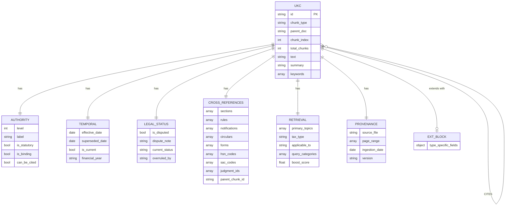

# GST Legal Chatbot — Schema Design Document

> **Scope:** Defines the complete data schema for all 21 chunk types in the GST RAG system, based on actual observed JSON structures. Covers the current state, the normalized target schema, type-specific extensions, metadata strategy, and the retrieval-aware design decisions that enterprise legal RAG systems use.
>
> **Version:** 1.0 | **Date:** 2026-03-03 | **Status:** Design Reference

---

## Part 1 — The Problem with the Current Schema

The [merge_all_chunks.py](file:///c:/Users/SaifMalik/Desktop/Aaizel%20Tech/wddmas-commercial-server/ingestion/merge_all_chunks.py) script currently only checks for two fields:

```python
REQUIRED_KEYS = {"id", "text"}
```

This means chunks from 21 very different files are merged into one flat list. The chatbot then gets:

- An `hsn_chunk` (product tax rate data) sitting next to a `judgment_chunk` (legal court ruling) with **no way to distinguish them at retrieval time**
- No standardized `authority_level` field — so the chatbot doesn't know if it's citing Parliamentary law or a blog article
- No `effective_date` field — so it cannot know if a rate/exemption is current or superseded
- No `is_disputed` flag — so it may confidently cite a judgment that has been overruled
- No `chunk_group_id` — so continuation chunks (part 2 of 20 in [contempary_issues.json](file:///c:/Users/SaifMalik/Desktop/Aaizel%20Tech/wddmas-commercial-server/data/processed/contempary_issues.json)) cannot be re-assembled

The goal of this schema is to fix all of the above while designing for:
1. **Accurate legal retrieval** — cite only what you're authorized to cite
2. **Temporal accuracy** — always serve the current law, not an older version
3. **Future GraphRAG** — links between chunks enable knowledge graph traversal
4. **Enterprise standards** — matches patterns used in legal AI systems like Harvey AI, CaseMine, and Westlaw Edge

---

## Part 2 — Current As-Is Schema (What Actually Exists)

### 2.1 Common Fields Observed Across Most Files

These fields appear in most or all of the 21 files:

```json
{
  "id":             "uuid-string",
  "doc_type":       "string  — e.g. 'CGST Act', 'Circular', 'QA_PAIR'",
  "chunk_type":     "string  — e.g. 'section', 'council_decision', 'analytical_review'",
  "parent_doc":     "string  — title of source document",
  "hierarchy_level":"integer — 1=act, 2=chapter, 3=section, 4=sub-section",
  "text":           "string  — the actual retrievable content",
  "keywords":       ["array of strings"],
  "cross_references": {
    "sections":      ["list of section numbers"],
    "rules":         ["list of rule numbers"],
    "notifications": ["list of notification numbers"]
  },
  "metadata": {
    "source":      "string  — human-readable source name",
    "source_file": "string  — original filename"
  }
}
```

### 2.2 Field Presence by File (Gap Analysis)

| Field | cgst | igst | rules | notif | circ | judg | hsn | sac | forms | council | faqs | solved_query | draft | scenarios | analytical | articles | contemporary | case_studies | gstat |
|-------|------|------|-------|-------|------|------|-----|-----|-------|---------|------|-------------|-------|-----------|------------|---------|-------------|-------------|-------|
| `id` | ✅ | ✅ | ✅ | ✅ | ✅ | ✅ | ✅ | ✅ | ✅ | ✅ | ✅ | ✅ | ✅ | ✅ | ✅ | ✅ | ✅ | ✅ | ✅ |
| `text` | ✅ | ✅ | ✅ | ✅ | ✅ | ✅ | ✅ | ✅ | ✅ | ✅ | ✅ | ✅ | ✅ | ✅ | ✅ | ✅ | ✅ | ✅ | ✅ |
| `doc_type` | ✅ | ✅ | ✅ | ✅ | ✅ | ✅ | ✅ | ✅ | ✅ | ✅ | ✅ | ✅ | ✅ | ✅ | ✅ | ✅ | ✅ | ✅ | ✅ |
| `keywords` | ✅ | ✅ | ✅ | ✅ | ✅ | ✅ | ✅ | ✅ | ✅ | ✅ | ✅ | ✅ | ✅ | ✅ | ✅ | ✅ | ⚠️ empty | ✅ | ✅ |
| `cross_references` | ✅ | ✅ | ✅ | ✅ | ✅ | ✅ | ❌ | ❌ | ✅ | ✅ | ✅ | ✅ | ✅ | ✅ | ✅ | ❌ | ❌ | ✅ | ✅ |
| `structure` | ✅ | ✅ | ✅ | ✅ | ✅ | ✅ | ❌ | ❌ | ✅ | ✅ | ✅ | ✅ | ✅ | ✅ | ✅ | ✅ | ✅ | ✅ | ✅ |
| `hierarchy_level` | ✅ | ✅ | ✅ | ✅ | ✅ | ✅ | ❌ | ❌ | ❌ | ✅ | ✅ | ✅ | ✅ | ✅ | ✅ | ❌ | ❌ | ✅ | ✅ |
| `is_continuation` | ❌ | ❌ | ❌ | ❌ | ❌ | ❌ | ❌ | ❌ | ❌ | ❌ | ❌ | ❌ | ❌ | ❌ | ❌ | ✅ | ✅ | ❌ | ❌ |
| `effective_date` | ❌ | ❌ | ❌ | ❌ | ❌ | ❌ | ❌ | ❌ | ❌ | ❌ | ❌ | ❌ | ❌ | ❌ | ❌ | ❌ | ❌ | ❌ | ❌ |
| `authority_level` | ❌ | ❌ | ❌ | ❌ | ❌ | ❌ | ❌ | ❌ | ❌ | ❌ | ❌ | ❌ | ❌ | ❌ | ❌ | ❌ | ❌ | ❌ | ❌ |
| `is_disputed` | ❌ | ❌ | ❌ | ❌ | ❌ | ❌ | ❌ | ❌ | ❌ | ❌ | ❌ | ❌ | ❌ | ❌ | ❌ | ❌ | ❌ | ❌ | ❌ |

**✅ = present | ⚠️ = present but often empty | ❌ = missing**

---

## Part 3 — The Unified Knowledge Chunk (UKC) Schema

This is the **target schema** every chunk should be normalized to after ingestion. It is what gets stored in your vector database and served to the chatbot.

```json
{
  // ─────────────────────────────────────────────
  // SECTION A: IDENTITY (always required)
  // ─────────────────────────────────────────────
  "id": "uuid-v4",
  
  "chunk_type": "enum — one of 21 allowed values (see Part 4)",

  "parent_doc": "string — title of source document",

  "chunk_index": 1,
  "total_chunks": 5,

  // ─────────────────────────────────────────────
  // SECTION B: CONTENT (the text vector is built from this)
  // ─────────────────────────────────────────────
  "text": "string — the main retrievable content",

  "summary": "string — 1-3 sentence summary for re-ranking and display",

  "keywords": ["array", "of", "strings"],

  // ─────────────────────────────────────────────
  // SECTION C: LEGAL AUTHORITY (drives retrieval priority)
  // ─────────────────────────────────────────────
  "authority": {
    "level": "integer — 1 to 6 (see authority scale below)",
    "label": "string — e.g. 'Parliamentary Statute', 'Subordinate Legislation'",
    "is_statutory": true,
    "is_binding": true,
    "can_be_cited": true
  },

  // ─────────────────────────────────────────────
  // SECTION D: TEMPORAL (drives recency filtering)
  // ─────────────────────────────────────────────
  "temporal": {
    "effective_date": "YYYY-MM-DD or null",
    "superseded_date": "YYYY-MM-DD or null",
    "is_current": true,
    "financial_year": "2023-24 or null"
  },

  // ─────────────────────────────────────────────
  // SECTION E: LEGAL STATUS (drives confidence flags)
  // ─────────────────────────────────────────────
  "legal_status": {
    "is_disputed": false,
    "dispute_note": "string or null",
    "current_status": "active | overruled | stayed | modified | repealed",
    "overruled_by": "chunk_id or null"
  },

  // ─────────────────────────────────────────────
  // SECTION F: CROSS-REFERENCES (drives GraphRAG edges)
  // ─────────────────────────────────────────────
  "cross_references": {
    "sections":       ["17(5)", "16(2)"],
    "rules":          ["36", "86B"],
    "notifications":  ["01/2017-CT(Rate)"],
    "circulars":      ["199/11/2023-GST"],
    "forms":          ["GSTR-3B"],
    "hsn_codes":      ["8517"],
    "sac_codes":      ["9983"],
    "judgment_ids":   ["chunk-uuid or case citation string"],
    "parent_chunk_id": "uuid of the first chunk if this is a continuation"
  },

  // ─────────────────────────────────────────────
  // SECTION G: RETRIEVAL HINTS (drives RAG retrieval logic)
  // ─────────────────────────────────────────────
  "retrieval": {
    "primary_topics":  ["ITC", "registration", "place_of_supply"],
    "tax_type":        "CGST | IGST | SGST | UTGST | CESS | ALL",
    "applicable_to":   "goods | services | both",
    "query_categories": ["rate_lookup", "notice_defence", "compliance_procedure"],
    "boost_score":     1.0
  },

  // ─────────────────────────────────────────────
  // SECTION H: PROVENANCE (source tracking)
  // ─────────────────────────────────────────────
  "provenance": {
    "source_file":    "string — original filename",
    "page_range":     [3, 4],
    "ingestion_date": "YYYY-MM-DD",
    "version":        "1.0"
  },

  // ─────────────────────────────────────────────
  // SECTION I: TYPE-SPECIFIC EXTENSION
  // (see Part 4 for each type's extension block)
  // ─────────────────────────────────────────────
  "ext": { }
}
```

---

## Part 4 — Authority Scale

All 21 data types map to one of 6 authority levels. This is the **most important field** for building a trustworthy legal chatbot.

```
Level 1 — PARLIAMENTARY STATUTE (highest)
  Files:  cgst_chunks, igst_chunks
  Meaning: Law passed by Parliament. Cannot be overridden by anything except 
           another Act of Parliament. Always cite this first.

Level 2 — SUBORDINATE LEGISLATION
  Files:  cgst_rules_chunks, igst_rules_chunks, gstat_rules
  Meaning: Rules made under authority granted by the Act. Legally binding.
           Can be amended by notifications.

Level 3 — EXECUTIVE ORDERS (binding, time-sensitive)
  Files:  notification_chunks
  Meaning: Government notifications issued under Act/Rules. Set actual rates,
           exemptions, deadlines. Override Level 2 for what they amend.
           ALWAYS check for the latest notification — it supersedes older ones.

Level 4 — ADMINISTRATIVE INSTRUCTIONS (binding on officers)
  Files:  circular_chunks
  Meaning: CBIC instructions. Binding on tax officers but NOT on courts.
           A court can overrule a circular. Always cross-check with judgments.

Level 5 — JUDICIAL INTERPRETATIONS
  Files:  judgment_chunks, case_studies
  Meaning: Court decisions. Binding as precedent within their jurisdiction.
           Supreme Court > High Court > GSTAT. Check `current_status`.

Level 6 — KNOWLEDGE/CONTEXT (not legally binding)
  Files:  gst_council_meetings, faqs, solved_query_chunks, section_analytical_review,
          article_chunks, case_scenarios, draft_replies, contempary_issues,
          forms, gstat_forms, hsn_chunks, sac_chunks
  Meaning: Supporting context. Excellent for explanation and retrieval but
           MUST NOT be cited as law in the bot's response.
```

---

## Part 5 — Type-Specific Extension Schemas (`ext` block)

Each chunk type has its own `ext` block. The base UKC stays the same; only `ext` varies.

### 5.1 CGST Act Chunks (`chunk_type: "cgst_section"`)

```json
"ext": {
  "act":             "CGST Act, 2017",
  "chapter_number":  "II",
  "chapter_title":   "Administration",
  "section_number":  "7",
  "section_title":   "Scope of Supply",
  "sub_section":     "(1)(a)",
  "provision_type":  "definition | levy | exemption | penalty | procedure | appeal",
  "amendment_history": [
    {
      "amended_by": "Finance Act, 2021",
      "effective_date": "2021-01-01",
      "nature": "Substituted sub-section (1)"
    }
  ]
}
```

### 5.2 IGST Act Chunks (`chunk_type: "igst_section"`)

```json
"ext": {
  "act":             "IGST Act, 2017",
  "chapter_number":  "IV",
  "section_number":  "12",
  "section_title":   "Place of Supply of Services",
  "applies_to":      "inter_state | import | export | both"
}
```

### 5.3 CGST Rules Chunks (`chunk_type: "cgst_rule"`)

```json
"ext": {
  "rule_number":     "36",
  "rule_title":      "Documentary requirements for ITC",
  "parent_section":  "16",
  "form_prescribed": "GSTR-3B",
  "sub_rule":        "(4)"
}
```

### 5.4 IGST Rules Chunks (`chunk_type: "igst_rule"`)

```json
"ext": {
  "rule_number":     "89",
  "rule_title":      "Application for refund of tax",
  "parent_section":  "54"
}
```

### 5.5 Notification Chunks (`chunk_type: "notification"`)

```json
"ext": {
  "notification_number": "01/2017-CT(Rate)",
  "notification_date":   "2017-06-28",
  "notification_type":   "rate | exemption | extension | amendment | rescission",
  "amends_notification": "null or prior notification number",
  "rescinded_by":        "null or later notification number",
  "tax_type":            "CGST | IGST | UTGST | CESS | ALL",
  "council_meeting_ref": "20th GST Council Meeting",
  "hsn_sac_scope":       ["8517", "8518"],
  "effective_from":      "2017-07-01"
}
```

> [!IMPORTANT]
> For notifications, `temporal.is_current` is the most critical field. If a notification has been **superseded by a later notification** on the same subject, `is_current` must be `false` and `legal_status.current_status` must be `"modified"` or `"repealed"`. The chatbot must filter on this field.

### 5.6 Circular Chunks (`chunk_type: "circular"`)

```json
"ext": {
  "circular_number":    "199/11/2023-GST",
  "circular_date":      "2023-07-17",
  "issued_by":          "CBIC",
  "clarifies_sections": ["17", "20"],
  "clarifies_rules":    ["42"],
  "overruled_by_judgment": null,
  "subject":            "Taxability of cross-charge of Head Office to Branch"
}
```

### 5.7 GST Council Meeting Chunks (`chunk_type: "council_decision"`)

```json
"ext": {
  "meeting_number":  "42",
  "meeting_date":    "2020-09-30",
  "agenda_item":     "6",
  "decision_type":   "rate_change | exemption | procedure | policy | no_decision",
  "decision_sentences": ["array of key decision sentences extracted from text"],
  "implemented_via": ["Notification 48/2020-CT", "Circular 141/2020"]
}
```

### 5.8 HSN Chunks (`chunk_type: "hsn_code"`)

```json
"ext": {
  "hsn_code":        "8517",
  "hsn_digits":      4,
  "chapter_code":    "85",
  "chapter_title":   "Electrical machinery and equipment",
  "description":     "Telephone sets; smartphones",
  "cgst_rate":       9.0,
  "sgst_rate":       9.0,
  "igst_rate":       18.0,
  "cess_rate":       0.0,
  "rate_notification": "01/2017-CT(Rate)",
  "rate_effective_from": "2017-07-01",
  "exemption_notification": null,
  "is_exempt":       false,
  "is_nil_rated":    false,
  "is_zero_rated":   false
}
```

> [!IMPORTANT]
> The `rate_notification` field is critical. The chatbot must cross-validate the HSN rate against the latest notification. If `temporal.is_current` of the notification is `false`, the chatbot must fetch the current notification to get the right rate.

### 5.9 SAC Chunks (`chunk_type: "sac_code"`)

```json
"ext": {
  "sac_code":        "998213",
  "section":         "Section J — Financial and related services",
  "description":     "Legal advisory services",
  "cgst_rate":       9.0,
  "sgst_rate":       9.0,
  "igst_rate":       18.0,
  "rate_notification": "11/2017-CT(Rate)",
  "is_exempt":       false,
  "rcm_applicable":  false
}
```

### 5.10 Forms (`chunk_type: "gst_form"`)

```json
"ext": {
  "form_number":     "GSTR-3B",
  "form_name":       "Monthly Self-Assessed Return",
  "prescribed_under_rule": "61",
  "filing_frequency": "monthly | quarterly | annual | on_event",
  "applicable_to":   "regular | composition | non_resident | all",
  "due_date_normal": "20th of following month",
  "current_due_date_notification": "07/2024-CT",
  "purpose_summary": "Self-assessed summary of output tax liability and ITC"
}
```

### 5.11 GSTAT Rules (`chunk_type: "gstat_rule"`)

```json
"ext": {
  "rule_number":     "Rule 5",
  "rule_title":      "Qualifications for appointment as Judicial Member",
  "parent_act":      "CGST Act, 2017",
  "parent_section":  "110"
}
```

### 5.12 GSTAT Forms (`chunk_type: "gstat_form"`)

```json
"ext": {
  "form_number":     "APL-01",
  "purpose":         "Appeal to Appellate Authority",
  "prescribed_under": "Section 107"
}
```

### 5.13 Judgment Chunks (`chunk_type: "judgment"`)

```json
"ext": {
  "case_name":      "Ashok Leyland Ltd. vs. Assistant State Tax Officer",
  "court":          "Kerala High Court",
  "court_level":    "HC | SC | AAR | AAAR | GSTAT | Other",
  "judgment_date":  "2018-11-15",
  "citation":       "[2018] 12 GSTL 345 (HC-Kerala)",
  "petitioner":     "Ashok Leyland Ltd.",
  "respondent":     "Assistant State Tax Officer",
  "decision":       "in_favour_of_assessee | in_favour_of_department | remanded | mixed",
  "sections_in_dispute": ["129", "130"],
  "rules_in_dispute":    ["138"],
  "case_note":      "string — 3-5 line summary of legal principle established",
  "principle":      "string — the one-line legal rule this case establishes",
  "current_status": "active | overruled | stayed | distinguished | affirmed",
  "overruled_by":   "null or case citation",
  "followed_in":    ["list of judgment chunk ids that followed this case"]
}
```

> [!CAUTION]
> The `current_status` field is a hard safety gate. Any judgment with `current_status: "overruled"` or `current_status: "stayed"` must be flagged to the chatbot retriever. The chatbot must NEVER cite an overruled judgment as valid precedent.

### 5.14 Case Studies (`chunk_type: "case_study"`)

```json
"ext": {
  "source_judgment_id": "chunk-uuid of the original judgment",
  "case_name":          "same as judgment",
  "structured_analysis": {
    "facts":       "string",
    "issue":       "string",
    "arguments":   "string",
    "decision":    "string",
    "takeaway":    "string"
  },
  "sections_applied": ["129"],
  "difficulty_level": "basic | intermediate | advanced"
}
```

### 5.15 FAQs (`chunk_type: "faq"`)

```json
"ext": {
  "topic_category":  "ITC | Registration | Returns | E-way Bill | Anti-Profiteering | ...",
  "parent_doc":      "FAQ on Anti-Profiteering",
  "question":        "string — just the question",
  "answer":          "string — just the answer",
  "faq_serial":      "Q.15",
  "official_source": "CBIC FAQ Publication, 2018"
}
```

### 5.16 Solved Query Chunks (`chunk_type: "solved_query"`)

```json
"ext": {
  "question":       "string — the original informal question",
  "answer":         "string — the expert answer",
  "question_style": "procedural | rate_lookup | notice_defence | conceptual | grey_area",
  "csv_row_id":     "62242",
  "answer_quality": "verified | unverified"
}
```

### 5.17 Section Analytical Review (`chunk_type: "analytical_review"`)

```json
"ext": {
  "section_number":  "7",
  "section_title":   "Scope of Supply",
  "review_type":     "commentary | illustration | comparison | historical",
  "act_reference":   "CGST Act, 2017",
  "author":          "string or null",
  "is_continuation": false,
  "part_number":     1,
  "total_parts":     5
}
```

### 5.18 Article Chunks (`chunk_type: "article"`)

```json
"ext": {
  "article_title":  "GST on Cryptocurrency: An Analysis",
  "author":         "CA John Doe",
  "publication":    "Tax Management India",
  "publish_date":   "2023-09-15",
  "topic":          "cryptocurrency | liquidated_damages | real_estate | ...",
  "is_continuation": false,
  "part_number":    1,
  "total_parts":    3
}
```

### 5.19 Case Scenarios (`chunk_type: "case_scenario"`)

```json
"ext": {
  "scenario_title":  "Composite Supply — Laptop with Accessories",
  "problem":         "string — the factual situation",
  "solution":        "string — the worked-out legal answer",
  "topic":           "composite_supply | itc | registration | place_of_supply | ...",
  "sections_applied": ["8", "9"],
  "difficulty":      "basic | intermediate | advanced",
  "source_type":     "hypothetical | based_on_court_ruling | based_on_AAR"
}
```

### 5.20 Draft Replies (`chunk_type: "draft_reply"`)

```json
"ext": {
  "notice_type":     "SCN | DRC-01 | Audit | Summons | Cancellation",
  "issue_addressed": "E-way bill cancellation | Rule 86B | ITC mismatch | ...",
  "reply_sections": [
    {
      "type":  "facts | submissions | legal_provisions | case_laws | conclusion",
      "text":  "string"
    }
  ],
  "cited_sections":      ["129", "130"],
  "cited_rules":         ["138"],
  "cited_circulars":     ["49/23/2018-GST"],
  "cited_judgment_ids":  ["uuid or citation string"],
  "taxpayer_favourable": true
}
```

### 5.21 Contemporary Issues (`chunk_type: "contemporary_issue"`)

```json
"ext": {
  "issue_title":       "Taxability of Liquidated Damages",
  "ambiguity_level":   "low | medium | high",
  "conflicting_views": [
    {
      "position": "Taxable as supply",
      "authority": "Circular 178/10/2022-GST",
      "authority_type": "circular"
    },
    {
      "position": "Not taxable — not a supply",
      "authority": "Several HC judgments",
      "authority_type": "judgment"
    }
  ],
  "current_state":    "unresolved | partially_resolved | council_agenda | legislated",
  "safe_answer":      "string — what the chatbot should say given uncertainty",
  "is_continuation":  false,
  "part_number":      1,
  "total_parts":      5
}
```

---

## Part 6 — Schema Normalization Map

This shows how each source file's current fields map to the UKC target schema.

### 6.1 CGST / IGST Act Files → UKC Mapping

| Source Field | → UKC Field | Notes |
|---|---|---|
| `id` | `id` | Direct map |
| `doc_type` | `chunk_type` (mapped) | `"CGST Act"` → `"cgst_section"` |
| `parent_doc` | `parent_doc` | Direct map |
| `hierarchy_level` | Feeds `ext.chapter_number` / `ext.section_number` | Decompose via `structure` |
| `structure.act` | `ext.act` | Direct map |
| `structure.chapter_number` | `ext.chapter_number` | Direct map |
| `structure.section_number` | `ext.section_number` | Direct map |
| `text` | `text` | Direct map |
| `summary` | `summary` | Direct map |
| `keywords` | `keywords` | Direct map |
| `cross_references.*` | `cross_references.*` | Direct map |
| `metadata.source_file` | `provenance.source_file` | Direct map |
| `metadata.page_range` | `provenance.page_range` | Direct map |
| ❌ (missing) | `authority.level` | Set to **1** (Act) |
| ❌ (missing) | `authority.is_statutory` | Set to **true** |
| ❌ (missing) | `temporal.is_current` | Default **true** (Acts rarely expire) |
| ❌ (missing) | `legal_status.current_status` | Default **"active"** |

### 6.2 Notification Chunks → UKC Mapping

| Source Field | → UKC Field | Notes |
|---|---|---|
| `structure.notification_number` | `ext.notification_number` | Direct map |
| `structure.date` | `ext.notification_date` + `temporal.effective_date` | Parse date |
| ❌ (missing) | `authority.level` | Set to **3** |
| ❌ (missing) | `temporal.is_current` | **Must be computed** — is there a later notification on the same subject? |
| ❌ (missing) | `ext.amends_notification` | Extract from text e.g. "amends notification 01/2017" |

### 6.3 Judgment Chunks → UKC Mapping

| Source Field | → UKC Field | Notes |
|---|---|---|
| `structure.court` | `ext.court` + `ext.court_level` | Direct map |
| `structure.decision` | `ext.decision` | Normalize values |
| `structure.case_note` | `ext.case_note` + `summary` | First 150 chars → `summary` |
| `current_status` | `legal_status.current_status` | Direct map — critical field |
| ❌ (missing) | `authority.level` | Set to **5** |
| ❌ (missing) | `legal_status.is_disputed` | **true** if `current_status != "active"` |

### 6.4 HSN / SAC Chunks → UKC Mapping

| Source Field | → UKC Field | Notes |
|---|---|---|
| `hsn_code` or `sac_code` | `ext.hsn_code` / `ext.sac_code` | Direct map |
| `cgst_rate`, `igst_rate` etc. | `ext.cgst_rate`, `ext.igst_rate` | Direct map |
| ❌ (missing) | `authority.level` | Set to **6** (knowledge/context) |
| ❌ (missing) | `authority.is_statutory` | **false** — rates are in notifications |
| ❌ (missing) | `ext.rate_notification` | Must link to the source notification |

### 6.5 Solved Query Chunks → UKC Mapping

| Source Field | → UKC Field | Notes |
|---|---|---|
| `structure.question` | `ext.question` + contributes to `text` | Direct map |
| `structure.answer` | `ext.answer` + contributes to `text` | Direct map |
| `text` (Q: ... A: format) | `text` | Keep as-is — ideal for semantic similarity |
| `cross_references.*` | `cross_references.*` | Direct map |
| ❌ (missing) | `authority.level` | Set to **6** |
| ❌ (missing) | `authority.can_be_cited` | **false** |

### 6.6 Contemporary Issues → UKC Mapping

| Source Field | → UKC Field | Notes |
|---|---|---|
| `doc_type: "Article"` | `chunk_type: "contemporary_issue"` | Override the doc_type |
| `metadata.is_continuation` | Feeds `cross_references.parent_chunk_id` logic | Link parts together |
| `metadata.part_number` | `ext.part_number` | Direct map |
| `metadata.total_parts` | `ext.total_parts` | Direct map |
| ❌ (missing) | `ext.ambiguity_level` | Must be tagged during ingestion |
| ❌ (missing) | `authority.level` | Set to **6** |
| ❌ (missing) | `legal_status.is_disputed` | Set to **true** by default |

---

## Part 7 — The `legal_weight` Score

For RAG retrieval re-ranking, every chunk should have a composite `legal_weight` score computed at ingestion time. The chatbot uses this to rank retrieved chunks before building the prompt context.

### Formula

```
legal_weight = (authority_score × 40%)
             + (recency_score   × 30%)
             + (specificity_score × 20%)
             + (relevance_bonus   × 10%)
```

### Component Definitions

**authority_score** (0.0 to 1.0):
```
Level 1 (Act)            → 1.00
Level 2 (Rules)          → 0.90
Level 3 (Notifications)  → 0.85
Level 4 (Circulars)      → 0.70
Level 5 (Judgments)      → 0.80  (if HC/SC active)
                         → 0.40  (if overruled/stayed)
Level 6 (Knowledge)      → 0.30
```

**recency_score** (0.0 to 1.0):
```
Effective date 0-1 year ago  → 1.00
1-3 years ago               → 0.80
3-5 years ago               → 0.60
5+ years ago                → 0.40
No date                     → 0.50
is_current = false          → 0.10  (strong penalty)
```

**specificity_score** (0.0 to 1.0):
- Exact section number match with query → 1.00
- Partial section match → 0.70
- Topic match → 0.50
- Generic content → 0.30

**relevance_bonus** (0.0 or 0.1):
- Source notification confirms the HSN/SAC rate → +0.1
- Judgment is directly on the disputed provision → +0.1
- FAQ explicitly cross-references the queried section → +0.1

---

## Part 8 — Indexing Strategy (Vector DB Namespaces)

Enterprise legal chatbots do NOT store all chunks in a single flat index. They use **namespaced indices** for:

1. **Faster retrieval** — pre-filter by namespace, then by similarity
2. **Controlled mixing** — never let an article rank higher than an Act section
3. **Query routing** — route specific query types to specific namespaces

### Recommended Namespace Structure

```
┌─────────────────────────────────────────────────────────────┐
│  NAMESPACE: statutory_law                                    │
│  Files: cgst_chunks, igst_chunks, cgst_rules, igst_rules,   │
│         gstat_rules                                          │  
│  Use when: Any question about what the law says              │
│  Filter key: authority.level IN (1, 2)                       │
└─────────────────────────────────────────────────────────────┘
┌─────────────────────────────────────────────────────────────┐
│  NAMESPACE: live_updates                                     │
│  Files: notification_chunks                                  │
│  Use when: Rate queries, deadline queries, current law       │
│  Filter key: temporal.is_current = true                      │
└─────────────────────────────────────────────────────────────┘
┌─────────────────────────────────────────────────────────────┐
│  NAMESPACE: clarifications                                   │
│  Files: circular_chunks, gst_council_meetings                │
│  Use when: Understanding how to apply the law                │
│  Filter key: authority.level = 4                             │
└─────────────────────────────────────────────────────────────┘
┌─────────────────────────────────────────────────────────────┐
│  NAMESPACE: judicial                                         │
│  Files: judgment_chunks, case_studies                        │
│  Use when: Contested matters, notice defence, precedent      │
│  Filter key: legal_status.current_status = "active"          │
└─────────────────────────────────────────────────────────────┘
┌─────────────────────────────────────────────────────────────┐
│  NAMESPACE: classification                                   │
│  Files: hsn_chunks, sac_chunks                               │
│  Use when: "What is GST on X?"                               │
│  Filter key: chunk_type IN ("hsn_code", "sac_code")          │
└─────────────────────────────────────────────────────────────┘
┌─────────────────────────────────────────────────────────────┐
│  NAMESPACE: knowledge                                        │
│  Files: faqs, solved_query_chunks, section_analytical_review,│
│         case_scenarios, articles, contemporary_issues,       │
│         draft_replies, forms, gstat_forms                    │
│  Use when: Explanation, example retrieval, semantic matching  │
│  Filter key: authority.level = 6                             │
└─────────────────────────────────────────────────────────────┘
```

### Query Router Logic

```python
def route_query(user_query: str, detected_intent: str) -> list[str]:
    """
    Returns ordered list of namespaces to search.
    First namespace gets highest weight in re-ranking.
    """
    routes = {
        "rate_lookup":          ["classification", "live_updates", "knowledge"],
        "compliance_procedure": ["statutory_law", "knowledge", "clarifications"],
        "notice_defence":       ["judicial", "statutory_law", "knowledge"],
        "itc_eligibility":      ["statutory_law", "clarifications", "judicial"],
        "definition_lookup":    ["statutory_law", "knowledge"],
        "grey_area":            ["knowledge", "clarifications", "judicial"],
        "policy_rationale":     ["clarifications", "knowledge"],
        "appeal_procedure":     ["statutory_law", "knowledge"],
        "form_filing":          ["knowledge", "statutory_law", "live_updates"],
        "general":              ["knowledge", "statutory_law", "live_updates"]
    }
    return routes.get(detected_intent, routes["general"])
```

---

## Part 9 — GraphRAG Edge Types (Future-Ready Schema)

When you upgrade to GraphRAG (knowledge graph + vector retrieval), these are the edge types to implement between chunks:

```
EDGE TYPE            | FROM            | TO               | HOW POPULATED
────────────────────────────────────────────────────────────────────────────
EMPOWERS             | cgst_section    | cgst_rule        | cross_references.rules
AMENDS               | notification    | cgst_rule        | text pattern "amends Rule X"
CLARIFIES            | circular        | cgst_section     | ext.clarifies_sections
IMPLEMENTS           | notification    | council_decision | ext.council_meeting_ref
INTERPRETS           | judgment        | cgst_section     | ext.sections_in_dispute
OVERRULES            | judgment        | judgment         | ext.current_status = "overruled"
FOLLOWS              | judgment        | judgment         | ext.followed_in list
APPLIES_RATE_TO      | notification    | hsn_code         | ext.hsn_sac_scope
REFERENCES           | faq             | cgst_section     | cross_references.sections
REFERENCES           | solved_query    | cgst_section     | cross_references.sections
CITES                | draft_reply     | judgment         | ext.cited_judgment_ids
CITES                | draft_reply     | circular         | ext.cited_circulars
ILLUSTRATES          | case_scenario   | cgst_section     | cross_references.sections
ANALYZES             | analytical_review | cgst_section   | ext.section_number
IS_CONTINUATION_OF   | any             | any              | cross_references.parent_chunk_id
FROM_MEETING         | council_decision | notification    | ext.implemented_via
```

---

## Part 10 — Full Schema ER Diagram



---

## Part 11 — Validation Rules for the Schema

These are the rules the ingestion pipeline must enforce before writing any chunk to the vector database:

```python
VALIDATION_RULES = {

    # Hard failures — reject chunk if violated
    "REQUIRED_FIELDS": [
        "id", "chunk_type", "text", "authority.level",
        "temporal.is_current", "legal_status.current_status"
    ],
    
    "CHUNK_TYPE_MUST_BE_KNOWN": True,  # Reject unknown chunk_types
    "TEXT_MIN_LENGTH": 50,            # Reject chunks shorter than 50 chars
    "ID_MUST_BE_UUID": True,
    
    # Soft warnings — log but do not reject
    "SUMMARY_RECOMMENDED": True,
    "KEYWORDS_MIN_COUNT": 3,
    "CROSS_REFERENCES_RECOMMENDED_FOR": [
        "cgst_section", "igst_section", "cgst_rule", "circular",
        "notification", "judgment", "faq"
    ],
    
    # Business rules
    "JUDGMENT_MUST_HAVE_CURRENT_STATUS": True,
    "NOTIFICATION_MUST_HAVE_EFFECTIVE_DATE": True,
    "HSN_SAC_MUST_HAVE_RATE": True,
    "DRAFT_REPLY_MUST_HAVE_CITED_SECTIONS": True
}
```

---

## Part 12 — Implementation Priority

Build the schema adoption in this order:

```
Phase 1 — Add Critical RAG Fields (immediate, no re-ingestion)
  ├── authority.level    (add to merge step — assign by file name)
  ├── temporal.is_current (default true, update manually for old notifications)
  └── legal_status.current_status (default "active")

Phase 2 — Normalize Chunk Types (next sprint)
  ├── Standardize chunk_type enum across all 21 files
  ├── Add ext block per type
  └── Link continuation chunks via parent_chunk_id

Phase 3 — Temporal Intelligence (notification pipeline)
  ├── Build notification supersession tracker
  ├── Auto-set is_current = false when newer notification found
  └── Add effective_date to all notification chunks

Phase 4 — GraphRAG Edges (future upgrade)
  ├── Build edge extraction from cross_references
  ├── Add OVERRULES edge for judgments
  └── Add AMENDS edge for notifications
```

---

## Quick Reference: All 21 Chunk Types

| # | `chunk_type` value | Authority Level | `is_statutory` | Namespace |
|---|---|---|---|---|
| 1 | `cgst_section` | 1 | true | statutory_law |
| 2 | `igst_section` | 1 | true | statutory_law |
| 3 | `cgst_rule` | 2 | true | statutory_law |
| 4 | `igst_rule` | 2 | true | statutory_law |
| 5 | `notification` | 3 | true | live_updates |
| 6 | `circular` | 4 | false | clarifications |
| 7 | `council_decision` | 6 | false | clarifications |
| 8 | `gstat_rule` | 2 | true | statutory_law |
| 9 | `gstat_form` | 6 | false | knowledge |
| 10 | `hsn_code` | 6 | false | classification |
| 11 | `sac_code` | 6 | false | classification |
| 12 | `gst_form` | 6 | false | knowledge |
| 13 | `judgment` | 5 | false | judicial |
| 14 | `case_study` | 6 | false | judicial |
| 15 | `faq` | 6 | false | knowledge |
| 16 | `solved_query` | 6 | false | knowledge |
| 17 | `analytical_review` | 6 | false | knowledge |
| 18 | `article` | 6 | false | knowledge |
| 19 | `case_scenario` | 6 | false | knowledge |
| 20 | `draft_reply` | 6 | false | knowledge |
| 21 | `contemporary_issue` | 6 | false | knowledge |

> [!NOTE]
> Levels 1–5 have `is_statutory` = true for the parent document even when the chunk is not the main statutory text (e.g., a preamble chunk from the CGST Act is still Level 1). Level 6 chunks are **never** legally authoritative, but they are essential for explanation, context, and natural-language retrieval.
